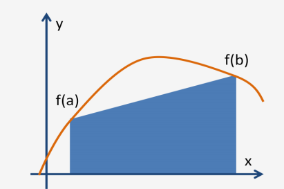

# Avances 17-04-2018

# Integrantes
- Alejandro Hernández 87806
- Federico Riveroll 105898
- Pablo Soria 111969

# Individual

- Alejandro Hernández

- Federico Riveroll

- Pablo Soria
Dentro de lo que se conoce como integración numérica, la regla del trapecio busca calcular el área bajo una curva por realizando una interpolación entre dos puntos por medio de un polinomio de grado 1, es decir una recta, gráficamente:

# Equipo
Comentamos sobre cuál de las tres alternativas resulta más viable de implementar; sin embargo, como no nos hemos decantado por alguna en particular, inicialmente estamos pensando implementar las tres para comparar su desempeño. Asimimsmo, tenemos planteado realizar la implementación en CUDA.

Finalmente, para estructurar los avances decidimos generar el siguiente cronograma para las primeras tres entregas:

- 10-04-2018: Entrega primer avance.

- 11-04-2018: Revisión del docker file que servirá para desarrollar el proyecto, o en su caso, levantar las instancias en AWS para iniciar la implementación cuanto antes.

- 12-04-2018: Revisión de investigación relativa a implementaciones más a detalle.

- 14-04-2018: Pruebas iniciales de implementación y revisión de alternativas.

- 17-04-2018: Entrega segundo avance.

- 20-04-2018: En caso de implementación exitosa de las tres alternativas, realizar comparativo de desempeño. En otro caso, buscar soluciones a problematica puntual.

- 22-04-2018: Revisión de algoritmos y fallas detectadas en el mismo.

- 24-04-2018: Entrega tercer avance.
