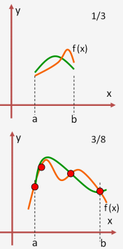

# Avances 17-04-2018

# Integrantes
- Alejandro Hernández 87806
- Federico Riveroll 105898
- Pablo Soria 111969

# Individual


- Alejandro Hernández


- Federico Riveroll


- Pablo Soria

Dentro de lo que se conoce como integración numérica, la regla del trapecio busca calcular el área bajo una curva por realizando una interpolación entre dos puntos por medio de un polinomio de grado 1, es decir una recta, gráficamente:


Una manera más exacta de realizar esta estimación del área bajo una curva es utilizar polinimios de grado superior para intentar ajustar una curva entre los dos puntos, esta regla se conoce como regla de smspon y en ocaciones como regla de Kepler.

Básicamente la regla interpola los puntos por medio de polinomios de Lagrange, cuando estamos hablando de 3 puntos (a, b y un punto medio)  se utilizan polinomios de orden dos reusltando en lo que se conoce como regla de Simpson de 1/3, por otro lado si utilizamos 4 puntos y conectamos por medio de polinomios de 3er orden nos encontramos frente a la conocida como Regla de Simpson de 3/8. Gráficamente estas reglas se ven de la siguiente forma:



Desde el punto de vista teórico, podemos realizar los siguientes cálculos para derivar la regla de simpson: 

consideremos el siguiente polinomio de *Lagrange* que aproxima a la funcion *f(x)* en los puntos *a*, *b*  y  *m = (b-a)/2*

$P_{2}(x) = f(a)\frac{(x-m)(x-b)}{(a-m)(a-b)} + f(m)\frac{(x-a)(x-b)}{(m-a)(m-b)} + f(b)\frac{(x-a)(x-m)}{(b-a)(b-m)} $

de esta forma podemos expresar a la integreal de *f(x)* como: 

$$\int\limits_a^b f(x) dx \approx \frac{b-a}{6}  [f(a) + 4f(m) + f(b)]$$

el principio que subyace detrás de la regla de Simpson de 3/8 es exactamente el mismo pero utilizando 4 puntos en lugar de tres es decir los dos extremos de intervalo y dos puntos intermedios a una equidistancia de *h = (b-a)/3* y utilizando polinomios de *Lagrange* de tercer orden. De este modo la regla de 3/8 de simpson para integración numérica se ve del siguiente modo: 


$$\int\limits_a^b f(x) dx \approx \frac{3h}{8}  [f(a) + 3f(\frac{2a+b}{3}) +3f(\frac{a+2b}{3})+ f(b)]$$


Hasta este punto hemos formulado la regla de Simpson simple utilizando únicamente un punto medio entre el intervalo [a,b] o 2 puntos equidistantes para el caso de Simpson 3/8 sin embargo para poder realizar una paralelización, es necesario obtener las reglas compuestas y subdidvidr el intervalo en *n* pedazos que eventualmente se podrán enviar a los distintos nodos, a esta extesión se le conoce como regla de Simpson compuesta y la lógica es la siguiente:

- Subidividir el intervalo [a,b] en n divisiones, las especificaciones de n dependerán de si se elige la regla de 1/3 o de 3/8, para el caso de 1/3 se requiere que n sea par y para el caso de 3/8 se requeire que n sea multiplo de 3
- Realizar la regla de Simpson (1/3 o 3/8 ) para cada sub-intervalo
-  Sumar todos los resultados obtenidos de cada regla aplicada a cada sub-intervalo.

Un primer enfoque para realizar esta tarea en el caso de la regla de 1/3 compuesta, subdividida en m intervalos es:

Implementación de Simspon de 1/3 en C:
```
double Simpsons1_3(int m, double a, double b, 
		    double (*func)(double)){
  int i; 
  double h = (b-a)/(2.0*m);
  double sum = 0.0, x;

  for(i=1;i<=m;i++){
    x = a + (2*i-1)*h;
    sum += func(x-h) + 4.0*func(x) + func(x+h);
  }
  sum *= (h/3.0);

  return sum;
}

```

```
double Simpsons3_8(int m, double a, double b, 
		    double (*func)(double)){
  int i; 
  double h = (b-a)/(3.0*m);
  double sum = 0.0, x;

  for(i=1;i<=m;i++){
    x = a + (2*i-1)*h;
    if(i%3 == 0){
    sum += 2*func(x);
    }
    else{
    sum += 3*func(x)
    }
  }
  sum *= (3*h/8.0);

  return sum;
}
```
Estos algoritmos reciben los valores de la cantidad de intervalos ( recordemos que debe ser par), el intervalo de integración [a,b] y la función f(x) y devuelve el resultado de la suma. Esta función nos servirá más adelante para paralelizar ya que desde este punto de vista, cada nodo recibirá una sub-división del rango entre [a,b] y dividirá este sub intervalo en m partes. 

**Nota:** Eventualmente será necesario poner una regla al momento de elegir el número de subdivisiones que evite los problemas de poner una m que no sea par en el caso de la regla de 1/3 y que m no sea múltiplo de 3 enel caso de la regla de 3/8.


# Equipo
Comentamos sobre cuál de las tres alternativas resulta más viable de implementar; sin embargo, como no nos hemos decantado por alguna en particular, inicialmente estamos pensando implementar las tres para comparar su desempeño. Asimimsmo, tenemos planteado realizar la implementación en CUDA.

Finalmente, para estructurar los avances decidimos generar el siguiente cronograma para las primeras tres entregas:

- 10-04-2018: Entrega primer avance.

- 11-04-2018: Revisión del docker file que servirá para desarrollar el proyecto, o en su caso, levantar las instancias en AWS para iniciar la implementación cuanto antes.

- 12-04-2018: Revisión de investigación relativa a implementaciones más a detalle.

- 14-04-2018: Pruebas iniciales de implementación y revisión de alternativas.

- 17-04-2018: Entrega segundo avance.

- 20-04-2018: En caso de implementación exitosa de las tres alternativas, realizar comparativo de desempeño. En otro caso, buscar soluciones a problematica puntual.

- 22-04-2018: Revisión de algoritmos y fallas detectadas en el mismo.

- 24-04-2018: Entrega tercer avance.
