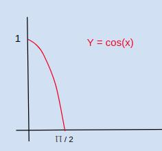
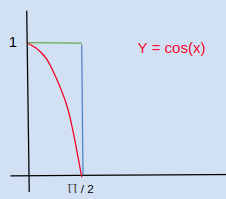
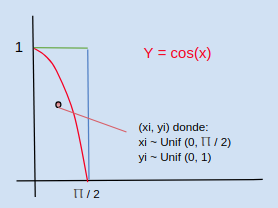
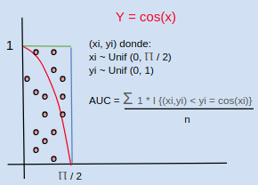

# Avances 24-04-2018

# Integrantes
- Alejandro Hernández 87806
- Federico Riveroll 105898
- Pablo Soria 111969

# Individual

- Alejandro Hernández

En virtud de que no se encontró puntualmente una implementación en CUDA para el cálculo de AUC usando Riemann y siguiendo la recomendación del profesor, opté por buscar otra extensión de C. Encontré que en esta referencia [http://www.shodor.org/media/content/petascale/materials/UPModules/AreaUnderCurve/AUC_Module_Document_pdf.pdf](http://www.shodor.org/media/content/petascale/materials/UPModules/AreaUnderCurve/AUC_Module_Document_pdf.pdf) también se incluye la implementación en MPI y se aprecia bien documentada. Asimismo, en dicho artículo se incluye el siguiente pseudocódigo que es plan de ejecución que seguiría:

```
All processes do the following:
0-1) Calculate the overall width of the domain of the
function and the width of a rectangle.
• If MY_THREAD_NUM == 0,
• WIDTH = X_RIGHT – X_LEFT
• RECTANGLE_WIDTH = WIDTH / NUMBER_OF_RECTANGLES
0-1) Calculate the number of rectangles for which the
process is responsible.
• If MY_THREAD_NUM == (1 mod OUR_NUMBER_OF_THREADS),
• OUR_NUMBER_OF_RECTANGLES = NUMBER_OF_RECTANGLES/
NUMBER_OF_PROCESSES
• If OUR_RANK == NUMBER_OF_PROCESSES – 1,
• OUR_NUMBER_OF_RECTANGLES = OUR_NUMBER_OF_RECTANGLES
+ NUMBER_OF_RECTANGLES mod NUMBER_OF_PROCESSES
0) Calculate the left x-boundary of the process.
• If MY_THREAD_NUM == (2 mod OUR_NUMBER_OF_THREADS),
• OUR_X_LEFT = (OUR_RANK * (NUMBER_OF_RECTANGLES/
NUMBER_OF_PROCESSES)) * RECTANGLE_WIDTH + X_LEFT
2-4) For each rectangle, parallelized by thread,
2) Calculate the x-value of the left side of the
rectangle:
• my_current_rectangle_left = OUR_X_LEFT +
my_current_rectangle_id * RECTANGLE_WIDTH
3) Calculate the height of the rectangle:
• my_current_rectangle_height =
FUNC(my_current_rectangle_left)
4) Calculate the area of the rectangle:
• our_areas[my_current_rectangle_id] =
RECTANGLE_WIDTH * my_current_rectangle_height
5) Calculate the total sum for the process.
• If MY_THREAD_NUM == 0,
• for each rectangle,
• our_total_sum = our_total_sum +
our_areas[my_current_rectangle_id]
6) Calculate the overall total sum.
• Each process sends our_total_sum to Rank 0
• Rank 0 adds sums to the_total_sum
```


- Federico Riveroll

__Plan de ejecución de Integración MCMC distribuída__

__¿Cómo funciona el algoritmo?__

El algoritmo de integración MC para calcular el área bajo la curva funciona de la siguiente manera:

1) Dada una función, por ejemplo <b>y = cos(x)</b>;


2) El algoritmo para calcular el Área bajo la curva consiste en formar un rectángulo en el área que queramos obtener la proporción del área, en este caso en <b> y=1</b>, y en <b>x = Ⲡ / 2</b>;


3) Y luego simular un punto aleatorio dentro de ese rectánculo y ver si cae abajo de la curva Y=cos(x) o arriba de ella;


4) Repetir la simulación de los puntos y contar los que están abajo de <b>Y = cos(x)</b> y dividirlos entre el total;



5) Al repetír el proceso muchas veces, la proporción de elementos bajo la curva es el área proporcionada en dicho rectánculo. Para que este proceso funcione en ecuaciones más complicadas se necesita iterar muchísimas veces.

__¿Cómo se planea implementar el algoritmo?__

En C nativo, simplemente haciendo el pseudocódigo:
<br>
<code>
cuenta = 0

loop ( n veces ) {
    xi = rand(0, x_objetivo)
    yi = rand(0, y_objetivo)
    if (yi < funcion_de(xi, yi)){
        cuenta ++
    }
}
return cuenta / n
</code>

__¿Cómo se planea paralelizar?__

Con la librería de OpenMPI para C.

Se planea hacer un programa "molde" que realice n/p simulaciones (sindo p el número de particiones), que envíe desde consola con <b>mpirun -np p programa</b> 'p' instancias del programa que trabajen de manera asíncrona, y que devuelvan cada quien su promedio calculado, cuando los promedios sean regresados que estos mismos se promedien y la distribución de los mismos será <b>Normal con media en el área bajo la curva</b>, después la idea es graficar esos promedios y obtener tanto el AUC como una aplicación (fortuita) del teorema del límite central.


